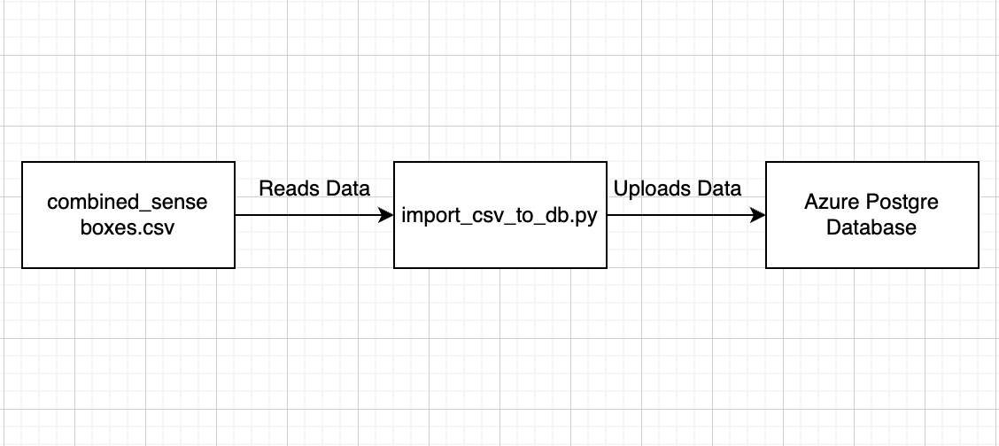
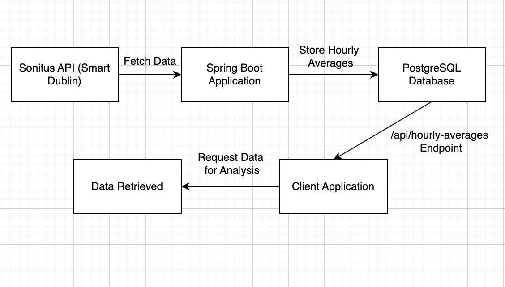

## Urban Computing Assignment 3
Student Name: Xinqi Cai | Student ID: 23332585

---

### Task 1

**Introduction**

This task involves storing sensor data in a cloud environment as a one-time batch process rather than real-time ingestion. Using a Python script to handle CSV data import, the data is uploaded once to a cloud-supported database for storage and retrieval. This report explains the setup, process, and results of storing sensor data from a local CSV file to a cloud database.

**Technical Diagram**  

**System Architecture**

This task involves:
- **Data Source**: Sensor data in CSV format from Assignment 2, containing records from various senseBoxes.
- **Cloud Database**: Azure PostgreSQL database configured to store the uploaded data.
- **Python Script**: A script (`import_csv_to_db.py`) handles the data ingestion process, reading from a CSV file and uploading each entry to the cloud database as a one-time operation.

**Data Collection and Storage Process**

1. **Data Preparation**  
   The sensor data is stored in a CSV file (`combined_senseboxes.csv`), containing relevant sensor measurements that need to be uploaded to the cloud database.

2. **Data Import Script**
   - The `import_csv_to_db.py` script reads data from the CSV file.
   - Each record is processed and sent to the cloud database.

3. **Database Structure**  
   The database is structured to store each sensor record with fields that represent:
   - Sensor ID
   - Timestamp
   - Measurement value
   - Location and other metadata

   This schema ensures easy querying and integration for future applications.

**Implementation Details**

- **import_csv_to_db.py**: This Python script handles data ingestion by connecting to the cloud database and iterating through each record in the CSV file as a one-time data load.
- **combined_senseboxes.csv**: Contains the sensor data to be uploaded, structured in a way that aligns with the cloud database schema.

**Evaluation**

The system successfully uploads the CSV data from Assignment 2 to the cloud database in a one-time batch process.

---

### Task 2

**Introduction**

This project is designed to integrate real-time sensor data with cloud storage and open data sources. By connecting an existing API (SmartDublin Sonitus) with a PostgreSQL database via Spring Boot, the application meets the requirements to gather, store, and retrieve hourly average sensor data in real-time, aiming to facilitate smart city initiatives.

**Architectural Diagram**  

**System Architecture**

This application uses the SmartDublin Sonitus API to gather noise sensor data in real-time, storing it in a PostgreSQL database using a Spring Boot service.

- **Sonitus API**: Requests are made every five minutes to retrieve noise level data for the past hour.
- **Spring Boot**: Acts as a backend service, managing API requests and data storage.
- **PostgreSQL**: Used to store retrieved sensor data for analysis and retrieval.

**Data Collection Process**

1. **Data Retrieval from Sonitus API**
   - The application requests hourly averages from the Sonitus API every five minutes.
   - Data is retrieved by setting the `start` parameter to five minutes before the current time and `end` to the current timestamp.
   - Using a scheduled task, data is collected periodically and stored in PostgreSQL.

2. **Real-Time Data Storage**
   - Data is stored in PostgreSQL in real-time as it is received.
   - The application's scheduling functionality enables it to fetch and update data consistently.

3. **Database Schema**
   - PostgreSQL tables store hourly noise averages, with fields to accommodate timestamp, noise level readings, and additional metadata.
   - The database schema supports efficient storage and retrieval of historical sensor data.

**Code Implementation**

- **SonitusApiService.java**: Manages the interaction with the SmartDublin Sonitus API. It contains logic to fetch data every five minutes and convert JSON responses into Java objects for storage.

- **HourlyAverage.java**: Defines the structure for the noise data, including attributes like timestamp and average noise level.

- **Monitor.java and MonitorController.java**: Implements the REST endpoints to enable access to stored noise data, allowing clients to retrieve data on demand.

**Evaluation**

- The system successfully stores real-time noise data from the SmartDublin Sonitus API.
- Data retrieval was tested to confirm that it meets the expected requirements for real-time storage and accessibility.

**Conclusion**

This project demonstrates practical skills in using cloud infrastructure, RESTful API integration, and database management for real-time data storage. By leveraging open data, the system provides a foundation for further applications in smart city technologies.

**AI Tool Use Statement**  
The use made of AI tools in the preparation of this assignment includes:
- ChatGPT private subscription: Assistance in structuring the report outline, crafting descriptions, and providing formatting suggestions for technical documentation.